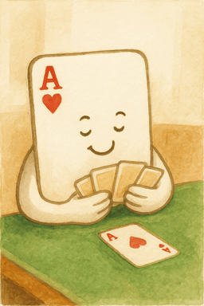

<p align="center">
  
</p>
<p align="center"><b>ACE</b></p>
<p align="center"><i>Adaptive Cardplay Engine</i></p>

## Overview

<b>ACE</b> is a modern, open-source C# library dedicated to the cardplay phase of the game of
<b>Bridge</b>, which is a classic example of an <i>imperfect information game</i> - games in which
players make decisions without full knowledge of the game state and where chance influences the
outcome - such games remain a persistent challenge in the field of AI.

One of the core issues in this domain, especially in card games, is <i>strategy fusion</i> -
a flaw where an engine evaluates each possible deal separately and picks the best move on average,
instead of choosing a plan that works across all indistinguishable scenarios. This often leads to
decisions that perform well in simulation but fail in real-world play.

ACE tackles this by incorporating ideas from this paper: https://arxiv.org/abs/2408.02380.
Rather than solving each sampled determinization using full knowledge from the outset, ACE delays
reasoning until it’s actually justified. This mechanism avoids premature commitments, reduces bias,
and leads to more realistic, human-like decisions.

## Features

ACE is still in an <b>experimental stage</b>, but already covers most practical use cases:

- <b>Support for any deal</b> – Analyzes games with any mix of <b>known</b> and <b>unknown</b> cards.
- <b>High-performance core</b> – Uses low-level bitwise operations for fast game processing.
- <b>Fast deal generator</b> – Quickly produces random deals for simulation and decision making.
- <b>Hand constraint system</b> – Filters deals by <b>HCP</b> and <b>suit lengths</b> <i>(more constraints coming soon)</i>.
- <b>Smart solving algorithm</b> – Based on research that avoids early commitment and strategy fusion.
- <b>Low memory consumption</b> – Uses a compact, efficient tree structure with minimal allocations.
- <b>Multithreading</b> – Runs simulations in parallel to accelerate large-scale analysis and sampling.
- <b>Backend-ready architecture</b> – Easily integrates with tools, bots, UIs, or research pipelines.
- <b>Runs on .NET Standard 2.0</b> – Cross-platform support for <b>Windows</b> and <b>Linux</b> (x64).

## History

Before starting ACE, I developed a separate project called <b>BGA (Bridge Gameplay Analysis)</b> –
a desktop application with a graphical interface focused on analyzing cardplay using a pure
PIMC-style algorithm with several domain-specific improvements. BGA supported only
<b>declarer play</b> and produced convincing results across many test cases.

The project was described in my BSc thesis titled
<i>"Desktop application for the analysis of gameplay in the card game of Bridge"</i>, defended in
March 2023 at the university <i>Politechnika Bydgoska im. Jana i Jędrzeja Śniadeckich</i> in Poland.

In fact, as noted in the thesis paper, BGA was able to solve
<b>more Bridge puzzles than a human expert</b> under the same conditions – demonstrating the practical
strength of the approach. However, BGA relied on heuristics, which in some edge cases led to
suboptimal decisions when evaluation failed to capture the true complexity of the position.

<b>ACE is a completely new project</b>, built from the ground up as a high-performance backend library
with a different architecture and philosophy. While it draws on insights gained from developing
BGA, it introduces new solving methods, supports both declarer and defender perspectives, and
focuses on reducing strategy fusion using more principled reasoning inspired by recent research.

## Installation

You can use ACE by adding the source code directly to your project or by compiling it as a local DLL.  
The project is built in a Visual Studio environment and can be run from source using the included launcher.

### Requirements:
- Target framework: <b>.NET Standard 2.0</b> or higher
- <b>Windows</b> or <b>Linux</b> operating system (<b>x64</b> architecture)
- Native solver <code><b>libbcalcdds</b></code> must be available at runtime

Once installed or built, you can reference the compiled DLL in your .NET project like any standard library.  
This is currently the only way to use it - a NuGet package is not available yet, but planned for future release.  
Make sure to also include the native solver dependency, which is required at runtime to perform simulations.

You can find platform-specific versions in the <code>runtimes</code> folder:
- <code>runtimes/win-x64/native/libbcalcdds.dll</code> for <b>Windows x64</b>  
- <code>runtimes/linux-x64/native/libbcalcdds.so</code> for <b>Linux x64</b>

## Usage

### Creating a new game

Here’s a basic example of how to initialize a new game of Bridge with optional hand constraints.

```csharp
var constraints = new ConstraintSet();
constraints[Player.East].Hcp    = new Range(8, 37);
constraints[Player.East].Spades = new Range(5, 13);

var deal = "AJ82.6.A74.QJ643 ... 3.AQT52.K963.K98 ...";
var options = new GameOptions
{
    Deal        = deal,
    Declarer    = Player.North,
    Contract    = Contract.Parse("3NT"),
    Constraints = constraints
};

var game = Game.New(options);
```

We define a new <code>ConstraintSet</code>, which allows you to specify HCP range and suit length for each player.  
In this example, we require that East player holds between 8 and 37 HCP, and has at least 5 spades in hand.  
You can also use the <code>ConstraintSet.Empty</code> property to skip these constraints when none are needed.

The <code>deal</code> string uses PBN format, where hands are listed in the order North–East–South–West (NESW).  
In this example, only North and South are fully known, while East and West are left as unknown using <code>...</code>.  
You can find the full PBN specification here: https://www.tistis.nl/pbn/pbn_v21.txt.

We create a <code>GameOptions</code> object to define the deal, specify declarer and contract, and apply any constraints.  
Once the options are set up, we can create a new game instance using the <code>Game.New</code> function. That's it!

---

### Legality checking

ACE allows querying pseudo-legal moves during gameplay - "pseudo" because some cards may still be hidden.  
You can list the current player's available moves and check whether a specific card is legal in the current game state.  

```csharp
Console.WriteLine("Available moves: " + string.Join(", ", game.GetMoves()));

if (!game.IsLegit("AS"))
    Console.WriteLine("Ace of Spades is not legal in this state!");
```

Card strings follow the format: rank first, then suit - in this example, <code>"AS"</code> represents the Ace of Spades.  
Valid suits are: <code>S</code> (Spades), <code>H</code> (Hearts), <code>D</code> (Diamonds), <code>C</code> (Clubs);
ranks are: <code>A K Q J T 9 8 7 6 5 4 3 2</code>.

---

### Gameplay

Once a game is initialized, you can simulate the play sequence using card strings:

```csharp
game.Play("QS"); // East plays Queen of Spades
game.Play("3S"); // South responds with 3 of Spades
```

It is also possible to undo and redo moves:

```csharp
game.Undo(); // Undo the last move (3S)
game.Redo(); // Redo the previously undone move (3S)
```

By default, each move is <b>legality-checked</b> (only playable cards are allowed in this state).  
To skip this check (e.g. when replaying known sequences), pass false as the second argument:

```csharp
game.Play("7S", false); // Bypass legality check for 7S
game.Play("AS", false); // Bypass check as well for AS
```

---

### Analyzing games

ACE provides a simple interface for evaluating cardplay decisions from the perspective of the current player.

To analyze the game, start by creating a new solver instance using <code>Engine.New</code> and attaching your game to it:

```csharp
var engine = Engine.New(threads: 10);
engine.SetGame(game);
```

Make sure to set the number of threads (typically a number of available CPU logical cores) via <code>threads: N</code>.  
Assigning more threads allows ACE to perform more simulations, improving search speed and accuracy.

You can subscribe to the <code>ProgressChanged</code> event to react to intermediate results during the search:

```csharp
engine.ProgressChanged += () =>
{
    var results = engine.Evaluate
    (
        opponent: Model.SoftMin(tau: 0.3),
        partner: Model.Optimistic()
    );
    Print(results, engine.Iterations);
};
```

In this example, we call a user-defined <code>Print</code> method to display evaluation scores and iterations performed.  
The <code>Evaluate</code> method returns a dictionary mapping each playable card to its current score (<code>&lt;Card, double&gt;</code>).

Each score returned by <code>Evaluate</code> typically falls between <code>0</code> and <code>1</code>,
representing the estimated chance of winning.

However, scores can go outside this range:
- Values <b>below 0</b> suggest that the side is guaranteed to fail its objective.
- Values <b>above 1</b> indicate an almost certain success for the side.

These extended scores help differentiate between borderline and extreme outcomes.  
The choice of evaluation models is discussed further in the next section of this documentation.

To begin the simulations, call <code>Search</code> function, which runs asynchronously for a given duration:

```csharp
engine.Search(duration: 20000, interval: 100, depth: 2);
```

It performs a tree search starting from the current state, exploring possible outcomes based on your parameters.  
You can either wait for completion, or subscribe to the <code>SearchCompleted</code> event to be notified when it finishes.

## Models

ACE supports many evaluation models that control how scores are assigned to playable cards during search.  
These models are typically assigned to specific players - whether it's ourselves, our partner, or the opponent.

Choosing the right models is crucial as it directly affects how the engine plays, depending on your goal.  
Some models prioritize consistent performance, while others aim to maximize rewards or minimize risk.

Here is a breakdown of the built-in models supported in ACE:

### Optimistic

The optimistic model evaluates each move by assuming the most favorable outcome across sampled scenarios.  
It is primarily used when the investigated player (the one making the decision) aims to maximize their reward.

Optimism is especially effective when player has a full knowledge of their hand and seeks out best-case situations.  
It is also ideal to use it when evaluating moves for the dummy, since the declarer has full control over both hands.

Formula:

```math
\begin{aligned}
{\mathrm{Optimistic}}(n) = \max_{c \, \in \, \mathcal{C}(n)} (v_c)
\end{aligned}
```

### Adversarial

The adversarial model evaluates each move by assuming the opponents will do everything to reduce our success.  
It selects the worst-case outcome from all sampled scenarios, making pessimistic assumptions about the distribution.

This model is useful when the expected outcome already looks favorable and we want to test how resilient it is.  
In other words, it answers: "Can I still succeed even if the opponents defend perfectly and the layout is uncertain?"

Formula:

```math
\begin{aligned}
{\mathrm{Adversarial}}(n) = \min_{c \, \in \, \mathcal{C}(n)} (v_c)
\end{aligned}
```

### Expectation

The expectation model assigns a score to each move by averaging its outcomes across all sampled scenarios.  
Each outcome is weighted by its probability, producing a risk-neutral estimate of the move’s performance.

This model is mostly used when aiming for long-term results rather than maximizing gains or minimizing risks.

Formula:

```math
\begin{aligned}
{\mathrm{Expectation}}(n) = \sum_{c \, \in \, \mathcal{C}(n)} (p_c \, \cdot \, v_c)
\end{aligned}
```

### Linear Blend

The linear-blend model combines expectation model with an additional strategy to form a single evaluation.  
This second strategy is an extremal estimate - best-case if it’s our move, or worst-case if it’s the opponent’s.  
Both components are blended using a tunable parameter <code>λ</code>, which controls the balance between them.

Its flexibility makes it ideal for simulating realistic play, where players balance safety with potential reward.  
This model is commonly used when evaluating decisions for both the defending partner and the opponents.

Formula:

```math
\begin{aligned}
\mathrm{B}(n) =
\begin{cases}
\displaystyle \max_{c \, \in \, \mathcal{C}(n)} (v_c), & \text{if } \mathrm{partner}(n) \\[3pt]
\displaystyle \min_{c \, \in \, \mathcal{C}(n)} (v_c), & \text{if } \mathrm{opponent}(n)
\end{cases}
\implies
\mathrm{Blend}_\lambda(n) = 
(1-\lambda)\,\mathrm{B}(n) + \lambda \sum_{c \, \in \, \mathcal{C}(n)} (p_c \, \cdot \, v_c)
\end{aligned}
```

### SoftMax

<b>Experimental model:</b> May not be fully covered in the official release.

Formula:

```math
\begin{aligned}
\mathrm{S}(n) = \max_{c \, \in \, \mathcal{C}(n)} \left( \frac{v_c}{\tau} \right) 
\implies
\mathrm{SoftMax}_\tau(n) =
\mathrm{S}(n) + \tau \, \log\!\Bigg(
   \sum_{c \, \in \, \mathcal{C}(n)} 
   p_c \, e^{\tfrac{v_c - \mathrm{S}(n)}{\tau}}
\Bigg)
\end{aligned}
```

### SoftMin

<b>Experimental model:</b> May not be fully covered in the official release.

Formula:

```math
\begin{aligned}
\mathrm{S}(n) = \min_{c \, \in \, \mathcal{C}(n)} \left( \frac{v_c}{\tau} \right) 
\implies
\mathrm{SoftMin}_\tau(n) =
\mathrm{S}(n) - \tau \, \log\!\Bigg(
   \sum_{c \, \in \, \mathcal{C}(n)} 
   p_c \, e^{-\tfrac{v_c - \mathrm{S}(n)}{\tau}}
\Bigg)
\end{aligned}
```

## License

This project is open-source and licensed under the MIT License.  
See the <a href="LICENSE">LICENSE</a> file for details.
